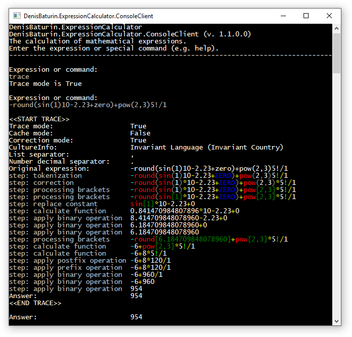

# Калькулятор для вычисления результатов математических выражений  
Консольное приложение на языке **C#**  
Автор: **Денис Батурин**

    Калькулятор создавался с образовательно-демонстрационной целью!  
Вопросы и комментарии можно писать сюда: [vk.com/denisbaturincom](http://vk.com/denisbaturincom) 

---

## Основные возможности:

* Вычисление результата математического выражения
* Поддержка различных типов операторов (констант, действий и функций)
* Коррекция упрощённой записи выражения
* Поддержка Unicode в названии операторов
* Поддержка региональных настроек
* Отображение трассировки вычисления
* Поддержка кэширования результатов
* Поддержка расширения функциональности
 
---
## Описание:
Калькулятор вычисляет результат математического выражения, записанного в виде строки текста.  
Например:  

    Expression or command:        
    -10-2*5^2-round(pi)+5!-(4+1)/5  
    Answer:                       56


---
## Операторы
Поддерживаются следующие типы операторов:  

* Константы  
* Действия  
    * Бинарные  
    * Унарные  
        * Префиксные  
        * Постфиксные  
* Функции  

**Константа** представляет собой буквенно-цифровое представление, заменяющее число.  
Например:  

    Expression or command:        
    pi
    Answer:                       3,1415926535897932384626433833

**Действие** выполняет какую-либо операцию с одним или двумя числами.  
Например:  

    1+2 -> бинарное действие - сложение двух чисел
    5!  -> унарное постфиксное действие - факториал числа

**Функция** отличается от действия тем, что она принимает в качестве обязательного параметра заключённый в скобки список значений.  
Например:  

    sin(1)  
    pow(2,3)  

В наименовании операторов **регистр символов не учитывается**. Операторы можно вводить как в верхнем или нижнем регистре, так и в комбинированном виде.  
Например:

    Expression or command:        
    COS(1) + cos(1) + cOs(1) + CoS(1)
    Answer:                       2,16120922347256

**Ассоциативность (порядок выполнения операторов)**  
При вычислении результата учитывается как явная ассоциативность (с помощью скобок), так и присущая конкретному типу операторов.  
Например, для унарных префиксных операторов в калькуляторе применяется правило правой ассоциативности.

---
## Коррекция выражения
Калькулятор может производить **коррекцию выражения**, записанного в упрощённой форме. В результате коррекции добавляются необходимые (подразумеваемые) действия умножения.  
Например:  

    2pi -> 2*pi  
    3(5+4) -> 3*(5+4)

Включение/отключение режима коррекции производится с помощью команды `correction`:  

    Expression or command:        
    correction
    Correction mode is False
  
По умолчанию режим коррекции включён.  

---
## Поддержка Unicode
Калькулятор поддерживает кодировку Unicode, поэтому в названии операторов можно использовать различные символы - ` © `, ` ¥ ` и т.п.

---
## Поддержка региональных настроек
Для калькулятора можно задать **региональные настройки**.
Эти настройки влияют на ввод и отображение чисел с дробной частью, а также списков значений. Другие параметры чисел (такие как разделители групп разрядов и т.п.) не учитываются.  
Установка региональных настроек производится с помощью команды `culture`, а затем ввода имени региональной культуры.  
Например:  

    Expression or command:        
    culture  
    Type CultureInfo name:        
    ru-RU  
    Current CultureInfo:          Russian (Russia)  
    List separator:               ;  
    Number decimal separator:     ,  


---
## Трассировка вычисления
Калькулятор поддерживает отображение этапов вычисления - трассировку. Включение/отключение режима трассировки производится с помощью команды `trace`:  

    Expression or command:        
    trace
    Trace mode is True
  
По умолчанию режим трассировки выключен.  
  
Пример трассировки вычисления:


---
## Кэширование результатов
Калькулятор поддерживает **кэширование** результатов вычисления выражения. Если режим кэширования включён, то результат вычисления выражения помещается в кэш. В дальнейшем для такого выражения вычисление не производится, а результат берётся сразу из кэша.  

Включение/отключение режима кэширования производится с помощью команды `cache`:  

    Expression or command:        
    cache
    Cache mode is True
  
По умолчанию режим кэширования выключён.  

---
## Поддержка расширения функциональности
Калькулятор поддерживает расширение функциональности, путём добавления новых операторов. Их можно добавить как непосредственно в коде, так и через внешние библиотеки. Все необходимые определения (программные контракты) для реализации нового оператора находятся в сборке `DenisBaturin.ExpressionCalculator.OperatorDefinitions`  
Чтобы подключить операторы из внешних библиотек, файлы библиотек необходимо разместить в каталоге `\Operators` (предварительно создав его, если он отсутствует) относительно исполняемого файла калькулятора.  
Примечание:  
Загрузка операторов происходит с помощью механизма **[MEF](https://msdn.microsoft.com/ru-ru/library/dd460648(v=vs.110).aspx)**, поэтому главный метод оператора нужно пометить атрибутом `Export` из пространства имён `System.ComponentModel.Composition`.  
**Пример создания оператора:**  
```c#

using System;
using System.Collections.Generic;
using System.ComponentModel.Composition;
using DenisBaturin.ExpressionCalculator.OperatorDefinitions;

[Export(typeof (Operator))]
public class Sqrt : OperatorFunction
{
    public override string StringView => "sqrt";
    public override Func<List<decimal>, decimal> PerformAction => x =>
        (decimal) Math.Sqrt((double) x[0]);
}
```


---
## Служебные команды
Калькулятор поддерживает некоторые служебные команды.  

**Список команд:**  

* help - отображение справки по командам  
* list - отображение списка доступных операторов  
* trace - включение/выключение режима трассировки  
* cache - включение/выключение режима кэширования  
* correction - включение/выключение режима коррекции  
* culture - установка конкретной региональной культуры  
* quit - выход из приложения
